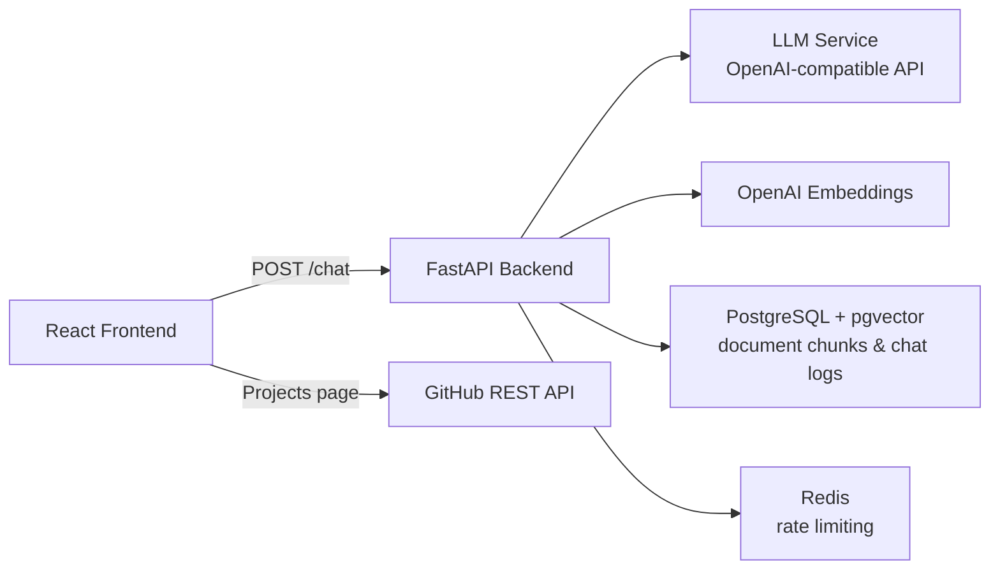

# Interactive AI Portfolio 🤖

[](https://fastapi.tiangolo.com/)
[](https://reactjs.org/)
[](https://vitejs.dev/)
[](https://opensource.org/licenses/MIT)

Create your own engaging, AI-powered conversational portfolio. This open-source project lets developers build an interactive portfolio where visitors can chat with an AI assistant that knows about your work, experience, and expertise.

Under the hood it is a small RAG (retrieval-augmented generation) application: your Markdown documents (CV, notes, writings) are split into chunks, embedded with OpenAI embeddings, and stored in PostgreSQL with `pgvector`. Each visitor question retrieves the most relevant chunks, which are passed as context to an LLM behind any OpenAI-compatible API, and the answer is streamed back to a React chat UI.

> **Credits:** this project is based on Alon Trugman's AI portfolio ([@alonxt](https://github.com/alonxt)), released under the MIT License (© 2025 Alon Trugman, see [LICENSE](LICENSE)).

## 📑 Table of Contents

- [Key Features](#-key-features)
- [Screenshots](#-screenshots)
- [Architecture](#-architecture)
- [Requirements](#-requirements)
- [Quick Start](#-quick-start)
- [Configuration](#-configuration)
- [Personalizing Your Portfolio](#-personalizing-your-portfolio)
- [API Reference](#-api-reference)
- [Deployment](#-deployment)
- [Security Notes](#-security-notes)
- [Troubleshooting](#-troubleshooting)
- [Development](#-development)
- [Contributing](#-contributing)
- [License](#-license)

## ✨ Key Features

- 🤖 **Interactive AI Assistant**: Engage visitors with personalized, context-aware conversations grounded in your own documents
- 📚 **RAG over Markdown**: Drop `.md` files into `backend/docs/`; they are chunked, embedded, and indexed in PostgreSQL + `pgvector` at startup. Changed files are detected by content hash and re-indexed automatically
- 🚀 **Real-time Streaming**: Fluid, chat-like experience with streaming responses
- 🔌 **Any OpenAI-compatible LLM**: Point `LLM_ROUTER_URL` at OpenAI, an LLM router such as [Requesty](https://requesty.ai/), or any other OpenAI-compatible endpoint
- 🧠 **Conversation memory**: The last 10 messages of the conversation are sent along with each question
- 🚦 **Rate limiting**: Redis-backed global and per-IP chat limits, with a friendly countdown shown in the UI
- 🗂 **Chat logging**: Every question and answer is stored in PostgreSQL with its session ID
- 🎨 **Modern UI**: Clean, responsive design focused on conversation, with Home (chat), About Me, Projects (your public GitHub repositories), and Blog (placeholder) pages
- 🔄 **Easy to Customize**: Content lives in `config.json` and a few files in `frontend/public`, not in code
- 🛠 **Modular Architecture**: Built for maintainability and easy extension

## 📸 Screenshots

<!-- TODO: screenshot -->

## 🏗 Architecture



How a chat request flows:

1. At startup the backend reads every `*.md` file in `backend/docs/`, splits it into chunks (1000 characters, 200 overlap), embeds each chunk with `EMBEDDING_MODEL`, and stores it in the `documentchunk` table.
2. The frontend sends the new message, the conversation history, a session ID, and a timestamp to `POST /chat`.
3. The rate-limit middleware checks the global limit and the per-IP chat limit in Redis.
4. The backend embeds the question, retrieves the 4 most similar chunks from `pgvector`, and builds a system prompt with them.
5. The LLM (`LLM_MODEL`) response is streamed back to the browser, then the exchange is logged in PostgreSQL.

### Tech Stack

- **Frontend**: React 18 + Vite, TailwindCSS, Framer Motion, React Router, React Markdown, Vercel Analytics
- **Backend**: Python 3.12, FastAPI, Uvicorn, SQLModel, LangChain (text splitting and embeddings), OpenAI Python SDK, PostgreSQL + pgvector, Redis
- **Infrastructure**: Docker Compose, Nginx (frontend container), fly.io (backend), Vercel (frontend)

## 📋 Requirements

- **Docker** and **Docker Compose** (for the one-command setup), or
  - Python 3.12 with [pipenv](https://pipenv.pypa.io/) for the backend
  - Node.js 20 for the frontend
  - PostgreSQL 16 with the `pgvector` extension (an image is provided in `backend/Dockerfile.postgres`)
  - Redis 7
- An **OpenAI API key** (used for embeddings)
- An **API key for an OpenAI-compatible LLM endpoint** (OpenAI itself, Requesty, etc.)

## 🚀 Quick Start

1. Create a new repository from this template and clone it.
2. Add your content to `frontend/public` and edit `config.json` - see [Personalizing Your Portfolio](#-personalizing-your-portfolio) and the [Config Setup Guide](frontend/CONFIGURATION.md).
3. Add your CV and other Markdown documents to `backend/docs/` (see [`backend/docs/example_resume.md`](backend/docs/example_resume.md)).
4. Copy the example environment file and fill in your API keys:
   ```bash
   cp env.example .env
   ```
5. Build and start the containers:
   ```bash
   docker compose build
   docker compose up
   ```
6. Open the portfolio at [http://localhost:3000](http://localhost:3000). The backend API is at [http://localhost:8000](http://localhost:8000) (interactive docs at [http://localhost:8000/docs](http://localhost:8000/docs)).

The root `docker-compose.yml` starts four services:

| Service | Image / build | Port | Notes |
|---------|---------------|------|-------|
| `db` | `backend/Dockerfile.postgres` (Postgres 16.1 + pgvector 0.7.4) | not exposed | Data in the `app-db-data` volume |
| `redis` | `redis:7-alpine` | not exposed | Data in the `redis-data` volume |
| `backend` | `backend/Dockerfile` | `8000` | Health check on `/health` |
| `frontend` | `frontend/Dockerfile` (Vite build served by Nginx) | `3000` → `80` | Starts once the backend is healthy |

`db` and `redis` sit on an internal network that is not reachable from outside Docker. Compose overrides `POSTGRES_SERVER=db`, `REDIS_URL=redis://redis:6379`, `UVICORN_IP=0.0.0.0` and `FRONTEND_URL=http://localhost:3000` for the backend.

To run the backend and frontend without the root Compose file, follow the [Backend Setup Guide](backend/README.md) and the [Frontend Setup Guide](frontend/README.md).

## 🔧 Configuration

The backend reads its settings from environment variables (loaded from a `.env` file via `python-dotenv`). Start from [`env.example`](env.example).

### Backend

| Variable | Required | Default in code | Example (`env.example`) | Description |
|----------|----------|-----------------|-------------------------|-------------|
| `UVICORN_IP` | Yes | none | `0.0.0.0` | Address the API server binds to |
| `UVICORN_PORT` | Yes | none | `8000` | Port the API server listens on |
| `LLM_ROUTER_URL` | No | OpenAI SDK default (`https://api.openai.com/v1`) | `https://router.requesty.ai/v1` | Base URL of the OpenAI-compatible chat completions API |
| `LLM_ROUTER_API_KEY` | No (falls back to `OPENAI_API_KEY`) | none | | API key for `LLM_ROUTER_URL`. If unset, the OpenAI SDK uses `OPENAI_API_KEY` |
| `LLM_MODEL` | Yes | none | `anthropic/claude-3-5-sonnet-latest` | Chat model name, as understood by the LLM endpoint (use an OpenAI model such as `gpt-4o` when calling OpenAI directly) |
| `EMBEDDING_MODEL` | Yes | none | `text-embedding-3-small` | OpenAI embedding model. The vector column is fixed at **1536 dimensions**, so the model must produce 1536-dimensional vectors |
| `OPENAI_API_KEY` | Yes | none | | OpenAI API key used for embeddings |
| `FRONTEND_URL` | Yes | none | `http://localhost:5173` | Origin allowed by CORS (in addition to `http://localhost`) |
| `POSTGRES_SERVER` | No | `localhost` | `localhost` | PostgreSQL host |
| `POSTGRES_PORT` | No | `5432` | `5432` | PostgreSQL port |
| `POSTGRES_DB` | Yes | none | `pgdb` | Database name (also used by the `db` container) |
| `POSTGRES_USER` | Yes | none | `pguser` | Database user (also used by the `db` container) |
| `POSTGRES_PASSWORD` | Yes | none | `docker` | Database password (also used by the `db` container) |
| `REDIS_URL` | Yes | none | `redis://localhost:6379` | Redis connection URL used for rate limiting |
| `GLOBAL_RATE_LIMIT` | Recommended | none | `1000/hour` | Total requests allowed across all clients, as `<count>/<second\|minute\|hour\|day>` |
| `CHAT_RATE_LIMIT` | Recommended | none | `30/minute` | `/chat` requests allowed per client IP, same format |

Notes:

- If a rate-limit value is missing or invalid, or Redis is unreachable, the limiter logs the error and **fails open** (requests are allowed).
- An unrecognized period unit (e.g. `30/week`) is treated as `day`.
- `/` and `/health` are never rate limited.

### Frontend

| Variable | Required | Default | Description |
|----------|----------|---------|-------------|
| `VITE_BACKEND_URL` | No | `http://localhost:8000` | Backend base URL. Read by Vite at **build time**, so set it in `frontend/.env` for `npm run dev`/`npm run build`, in `frontend/.env.production` for the Docker image, or in your hosting provider's build environment. The root `.env` is not read by Vite |

## 🎨 Personalizing Your Portfolio

| File | Purpose |
|------|---------|
| `frontend/public/config.json` | Name, email, social links (navbar icons), intro cards and paragraphs, chat placeholder and greeting. **Required** - the app shows an error without it. See the [Config Setup Guide](frontend/CONFIGURATION.md) |
| `frontend/public/about-me.md` | Content of the **About Me** page (rendered as Markdown) |
| `frontend/public/profile.jpg` | Profile picture on the home page |
| `frontend/public/icon.svg` | Browser tab icon |
| `backend/docs/*.md` | Knowledge base for the AI assistant (CV, writings, notes) |

The **Projects** page lists up to 6 non-fork public repositories from the GitHub API. The GitHub username for this page is **not** read from `config.json`: it is hardcoded as `useGithubRepos('alonxt', 6)` in `frontend/src/components/sections/Projects/index.jsx`. Edit it there to show your own repositories.

The **Blog** page currently shows a "Coming Soon!" placeholder.

## 📡 API Reference

FastAPI also serves interactive documentation at `/docs` (Swagger UI) and `/redoc`, and the schema at `/openapi.json`.

| Method | Path | Description |
|--------|------|-------------|
| `GET` | `/` | Liveness check, returns `{"Data": "Working!"}` |
| `GET` | `/health` | Health check, returns `{"status": "healthy"}` |
| `POST` | `/chat` | Send a message and stream the assistant's answer |

### `POST /chat`

Request body:

```json
{
  "message": "What does Alon do for a living?",
  "messages": [
    { "role": "assistant", "content": "Hey there! 👋 I'm Alon's AI assistant..." }
  ],
  "session_id": "0b6c0e3e-4f7c-4b0a-9c1e-2f1f3d8a1b2c",
  "timestamp": 1735689600
}
```

| Field | Type | Description |
|-------|------|-------------|
| `message` | string | The new user message |
| `messages` | array of `{role, content}` | Previous conversation messages (only the last 10 are used) |
| `session_id` | string | Client-generated session identifier, stored with the chat log |
| `timestamp` | number | Unix timestamp (seconds) |

The response has `Content-Type: text/event-stream`. Each line is a text fragment encoded as `0:<JSON string>`:

```text
0:"Alon is"
0:" a software engineer..."
```

When a rate limit is exceeded the API responds with `429` and a JSON body:

```json
{
  "detail": "Chat rate limit exceeded",
  "type": "chat_rate_limit_exceeded",
  "limit": "30/minute",
  "retry_after": 30,
  "friendly_message": "You're sending messages too quickly! Please wait before sending another message."
}
```

`type` is `rate_limit_exceeded` for the global limit and `chat_rate_limit_exceeded` for the per-IP chat limit.

## 🚢 Deployment

- **Backend**: deploy to [fly.io](https://fly.io) using the provided [`backend/fly.toml`](backend/fly.toml) - see the [Backend Setup Guide](backend/README.md#-deployment-on-flyio).
- **Frontend**: deploy to [Vercel](https://vercel.com) (SPA rewrites are configured in [`frontend/vercel.json`](frontend/vercel.json)) - see the [Frontend Setup Guide](frontend/README.md#-deployment-on-vercel).

Remember to set `FRONTEND_URL` on the backend to your deployed frontend origin (for CORS) and `VITE_BACKEND_URL` on the frontend to your deployed backend URL.

## 🔒 Security Notes

- Keep `.env` out of version control (it is already in `.gitignore`). Store production secrets with your platform's secret manager (e.g. `fly secrets set`).
- `backend/.dockerignore` does not exclude `.env`, so a `backend/.env` file would be copied into the backend image by `COPY . .`. Keep secrets in the root `.env` (used by Compose via `env_file`) or pass them at runtime.
- The `/chat` endpoint is public. It spends your LLM and embedding credits, so keep `GLOBAL_RATE_LIMIT` and `CHAT_RATE_LIMIT` set. Remember that the limiter fails open if Redis or the limit settings are unavailable.
- The per-IP limit uses the client address seen by the backend. Behind a reverse proxy or load balancer, all visitors may share the proxy's IP.
- Every question and answer is stored in the `chatlog` table with its session ID, and user questions are written to the application logs. Tell your visitors if you keep these, and treat the database as personal data.
- Anything in `backend/docs/` can be quoted to visitors by the assistant. Do not put private information there.
- The Nginx frontend container serves plain HTTP on port 80; put it behind a TLS-terminating proxy in production.
- The frontend loads Vercel Analytics (`@vercel/analytics`).

## 🩺 Troubleshooting

- **"Failed to load configuration" in the browser**: `frontend/public/config.json` is missing or is not valid JSON.
- **Backend fails with `Failed to create vector extension`**: the PostgreSQL server does not have `pgvector` installed. Use the image from `backend/Dockerfile.postgres` (or a pgvector-enabled image on fly.io).
- **Backend crashes on start with a `TypeError` about `int()`**: `UVICORN_PORT` is not set.
- **The assistant says it has no context**: check that your `.md` files are in `backend/docs/` and look for `Docs directory ... does not exist` in the backend logs.
- **Deleted a document but the assistant still knows about it**: startup indexing only adds and updates files; chunks of deleted files stay in the `documentchunk` table until you remove them.
- **Browser shows CORS errors**: `FRONTEND_URL` on the backend must exactly match the origin the frontend is served from (e.g. `http://localhost:3000` for Docker Compose, `http://localhost:5173` for `npm run dev`).
- **Frontend container calls the wrong backend**: `VITE_BACKEND_URL` is baked in at build time, and `frontend/.dockerignore` excludes `frontend/.env`, so without further setup the image uses the default `http://localhost:8000`. Set `VITE_BACKEND_URL` in `frontend/.env.production` before building the image; that file is copied into the build and read by `vite build`.
- **Changing `EMBEDDING_MODEL` breaks indexing**: the `embedding` column is `vector(1536)`; models with other dimensions will not fit.

## 🛠 Development

### Project layout

```text
.
├── backend/                  # FastAPI service
│   ├── app/
│   │   ├── controllers/      # API routes (chat_router.py)
│   │   ├── db/               # PostgreSQL/pgvector access
│   │   ├── logic/            # Chat service and document indexer
│   │   ├── middleware/       # Redis rate limiting
│   │   ├── models/           # Pydantic/SQLModel data structures
│   │   ├── startup/          # Startup document indexing
│   │   └── factory.py        # App and dependency wiring
│   ├── docs/                 # Markdown knowledge base for RAG
│   ├── tests/                # pytest suite
│   ├── run_server.py         # Entry point
│   ├── Dockerfile            # Backend image
│   ├── Dockerfile.postgres   # Postgres 16 + pgvector image
│   ├── docker-compose.yml    # Backend-only stack (db, redis, backend)
│   └── fly.toml              # fly.io configuration
├── frontend/                 # React + Vite app
│   ├── public/               # config.json, about-me.md, profile.jpg, icon.svg
│   ├── src/                  # Components, hooks, services, config loader
│   ├── Dockerfile            # Build + Nginx image
│   └── vercel.json           # Vercel SPA rewrites
├── docker-compose.yml        # Full stack (db, redis, backend, frontend)
└── env.example               # Example environment variables
```

### Backend

```bash
cd backend
pipenv install --dev
pipenv run python run_server.py   # needs PostgreSQL + pgvector and Redis, see backend/README.md
pipenv run pytest                 # run tests (coverage for app/ is on by default via pytest.ini)
```

A backend-only stack (Postgres, Redis, API) is available with `docker compose up` from the `backend/` directory; it exposes Postgres on port `5432`.

### Frontend

```bash
cd frontend
npm install
npm run dev        # http://localhost:5173
npm run build      # production build into dist/
npm run preview    # preview the production build
npm test           # Vitest (single run)
npm run test:watch # Vitest in watch mode
```

> **Note:** the `npm run lint` script is currently broken. It passes `--ext`, which ESLint 9's flat config (`eslint.config.js`) no longer accepts, so the command fails.

### CI

The [Run Tests](.github/workflows/run-tests.yml) GitHub Actions workflow runs the backend tests (Python 3.12.5, pipenv, pytest) and the frontend tests (Node.js 20, Vitest) on every push and pull request to `main`.

## 🤝 Contributing

Contributions are welcome! Please feel free to submit a Pull Request. Make sure `pipenv run pytest` (backend) and `npm test` (frontend) pass before opening it.

## 📝 License

This project is licensed under the MIT License - see the [LICENSE](LICENSE) file for details. Copyright © 2025 Alon Trugman, the original author of this project.


<div align="center">
Made with ❤️ by Alon Trugman
</div>
